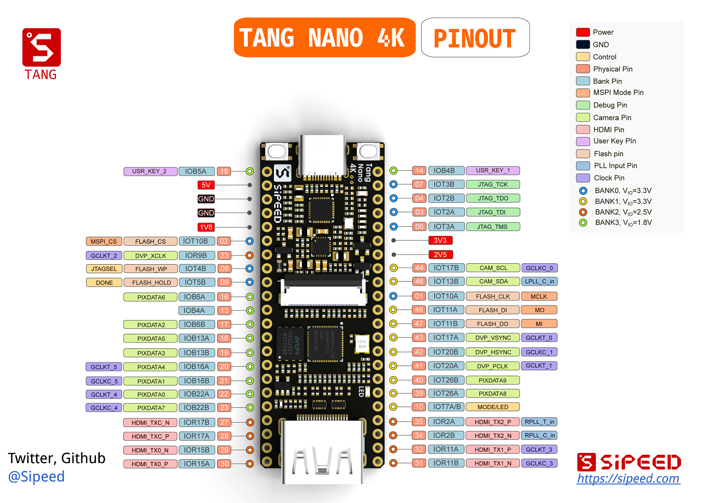

# Lichee Tang Nano 4K Demo

> Lichee Tang Nano 4K 是一块 [Sipeed](https://wiki.sipeed.com/hardware/zh/tang/Tang-Nano/Nano.html) 的FPGA开发板，其芯片为高云GW1NSR-LV4CQN48PC7/I6，内部带有ARM硬核MCU

## 搭建开发环境

FPGA开发环境为高云云源软件，此芯片使用教育版即可，商业版同样可以，但商业版需要申请license，下载地址 [云源软件](http://www.gowinsemi.com.cn/faq.aspx)

EMCU开发环境为高云的GMD或者Keil，选择通用的ARM Cortex-M3芯片，[官方文档](http://cdn.gowinsemi.com.cn/IPUG928-1.2_Gowin_EMPU(GW1NS-4C)_IDE%E8%BD%AF%E4%BB%B6%E5%8F%82%E8%80%83%E6%89%8B%E5%86%8C.pdf)。

